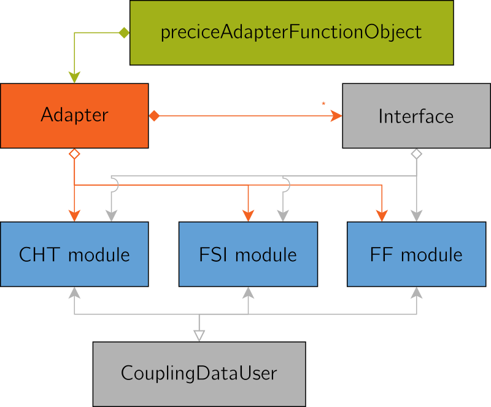
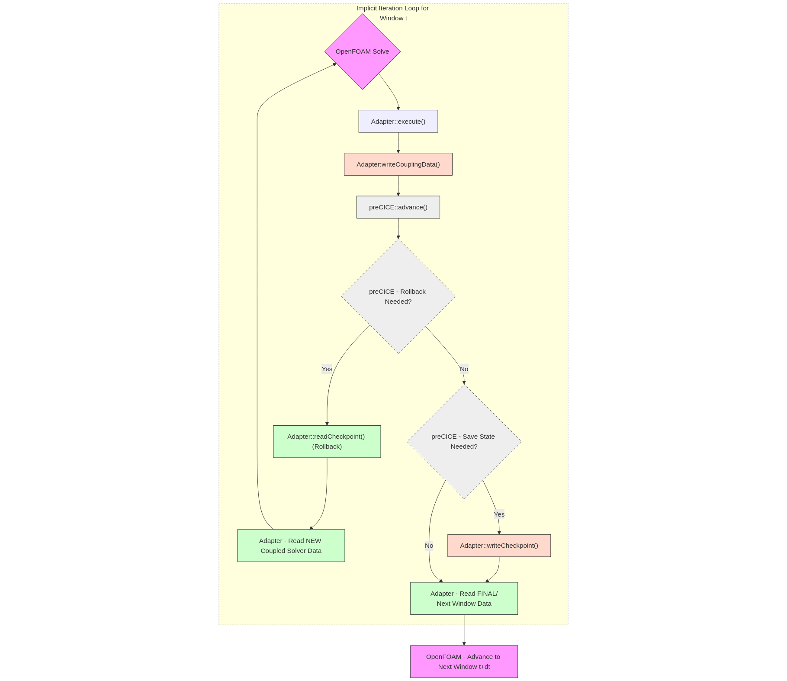

## Architecture

The OpenFOAM adapter separates the core functionality (e.g. calling preCICE methods) from the problem-specific methods (e.g. accessing fields and converting quantities). The latter is encapsulated into "modules", which add only a few lines of code in the core. The following, simplified UML diagram gives an overview:

While in the beginning the adapter only included a module for conjugate heat transfer, [a module for fluid-structure interaction](https://github.com/precice/openfoam-adapter/pull/56) and [a module for fluid-fluid coupling](https://github.com/precice/openfoam-adapter/pull/67) have been added since then.

## Starting points

In case you just want to couple a different variable, you need to create a new
coupling data user class in the `preciceAdapter::CHT` namespace or in a new one.
Then you need to add an option for it in the configuration part
to add objects of it into the `couplingDataWriters` and `couplingDataReaders`
whenever requested.

There are some `NOTE`s in the files [Adapter.H](https://github.com/precice/openfoam-adapter/blob/master/Adapter.H), [Adapter.C](https://github.com/precice/openfoam-adapter/blob/master/Adapter.C), [CHT/CHT.C](https://github.com/precice/openfoam-adapter/blob/master/CHT/CHT.C), and [CHT/Temperature.H](https://github.com/precice/openfoam-adapter/blob/master/CHT/Temperature.H) to guide you through the process.

_Note:_ make sure to include any additional required libraries in the `LIB_LIBS`
section of the `Make/options`. Since the adapter is a shared library,
another missing library will trigger an "undefined symbol" runtime error.

See also the notes and discussion in [issue #7: Create a module for fluid-structure interaction](https://github.com/precice/openfoam-adapter/issues/7).

## Checkpointing

In implicit coupling, the adapter manages the coupling loop, which entails checkpointing the simulation state (fields and mesh).
The checkpoints are stored and reloaded to repeat implicit time steps.
As the coupling data is exchanged, the adapter repeats the time step until convergence.
See this diagram for an overview:

While the adapter already takes care of checkpointing all of the usual field and mesh data, your solver or use specific scenario might need to checkpoint more objects.
Start by looking at the `setupCheckpointing()` function in the [Adapter.C](https://github.com/precice/openfoam-adapter/blob/master/Adapter.C).

### Checkpointed fields

For reference, here is a list of known checkpointed and non-checkpointed fields in the OpenFOAM adapter. The adapter automatically finds and checkpoints all objects registered in the OpenFOAM object registry (`mesh_.thisDb()`) that match the following types:

#### Volume fields

- `volScalarField`: e.g., `p`, `T`, `k`, `omega`, `nut`, `nu`, `rho`
- `volVectorField`: e.g., `U`, `Force`, `cellDisplacement`
- `volTensorField`: e.g., `grad(U)` (if exists, relevant closed issue [#158](https://github.com/precice/openfoam-adapter/issues/158))
- `volSymmTensorField`: e.g., `R` (Reynolds stress)

#### Surface fields

- `surfaceScalarField`: e.g., `phi` (flux), `faceDiffusivity`
- `surfaceVectorField`: e.g., `Uf`
- `surfaceTensorField`

#### Point fields

- `pointScalarField`
- `pointVectorField`: e.g., `pointDisplacement`
- `pointTensorField`

The adapter will only create the checkpoint list once during initialization: After the first solver step, it is assumed that no new fields have been created that need to be checkpointed.

#### Mesh data

To handle mesh motion (ALE), the adapter explicitly checkpoints:

- Mesh Points `mesh_.points()` and `mesh_.oldPoints()`
- Mesh Motion Flux `mesh_.phi()`

### Non-checkpointed fields

Certain fields are purposely not checkpointed, see issue [#324](https://github.com/precice/openfoam-adapter/issues/324) and explanation in [PR #387](https://github.com/precice/openfoam-adapter/pull/387). This is either because they are re-calculated when needed "on-demand" or because they are essentially static (dictionaries assumed unchanging).

#### Derived mesh fields

The following fields are recalculated by OpenFOAM when `fvMesh::movePoints` is called, so the adapter does not store them:

- `C` (Cell Centers)
- `Cf` (Face Centers)
- `Sf` (Face Area Vectors)
- `magSf` (Face Area Magnitudes)
- `delta` (Face-Center to Cell-Center distances)
- `V`, `V0`, `V00` (Cell Volumes): These are already properly checkpointed by OpenFOAM itself, except when subcycling (needs further handling when subcycling - [related discussion](https://github.com/precice/openfoam-adapter/pull/369#issuecomment-3748773060)).

#### Dictionaries

The adapter does not checkpoint `IOdictionary` objects, assuming they are unchanged over the time windows or handled by OpenFOAM otherwise. Examples:

- `controlDict`
- `transportProperties`
- `turbulenceProperties`
- `fvSchemes`, `fvSolution`
- `dynamicMeshDict`
- `preciceDict`
